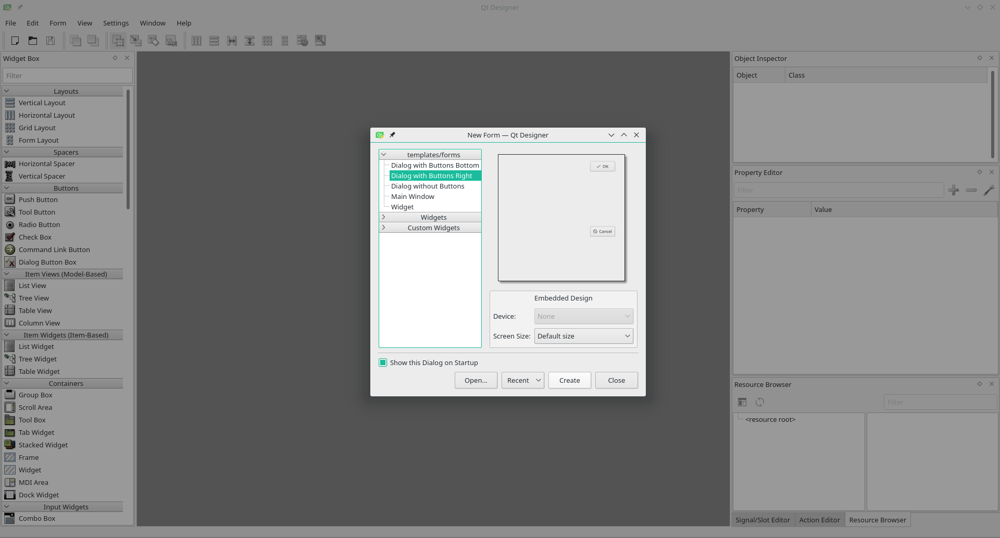
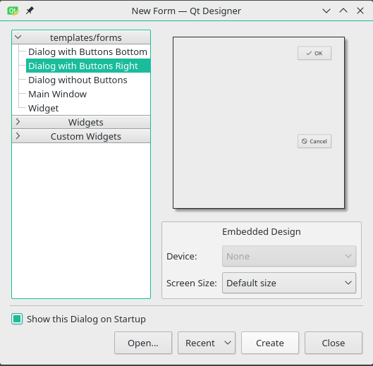
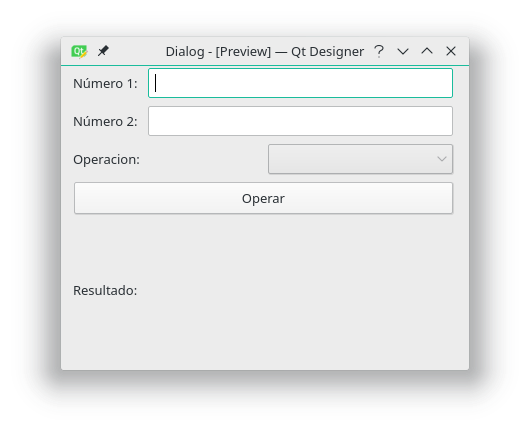

<!--
$theme: gaia
template: invert
-->


# Haciendo Interfaz gráfica con Python y QT

### Introducción a la elaboración de interfaces gráficas de usuario con python y qt

---

# ¿Que es QT?


+++

# Qt es ...
* Un framework 
* multiplataforma 
* orientado a objetos 
* usado para desarrollar (software) con **GUI**
* interfaz gráfica de usuario
* esta desarrollado en **C++** -> ***wtf???***
* etc...

+++

# Es Qt una tampa?

* No
* Pero es confuso el hecho de su multiple licenciamiento
* GNU LGPL 2.1
* GNU GPL 2 y 3
* [Propietaria][1]

[1]: https://www1.qt.io/licensing/

---

# Qt Bindings
## Qt dispone de una serie de bindings para diversos lenguajes de programación:

+++

* **PyQt** – Bindings GPL/Comercial para Python.
* PySide14 – LGPL bindings para Python de OpenBossa (subsidiario de Nokia).
* PythonQt15 – LGPL bindings para Python.
* Qyoto16 – Bindings para C# u otros lenguajes.NET. Existe un conjunto adicional de bindings Kimono17 para KDE.
* QtRuby18 – Bindings para Ruby. Existe un conjunto adicional de bindings, Korundum para KDE.
* Qt Jambi19 – Bindings para Java.

+++

* QtAda20 – Bindings para Ada.
* FreePascal Qt421 – Bindings para Pascal.
* Perl Qt422 – Bindings para Perl.
* PHP-Qt – Bindings para PHP.
* Qt Haskell23 – Bindings para Haskell.
* lqt24 – Bindings para Lua.
* DaoQt25 – Bindings para Dao.
* QtD26 – Binding para D.
---

# ¿Que es Python?


+++

# Python es: 
* Python es un lenguaje de programación 
* Es un lenguaje interpretado
* código legible y elegante.
* multiparadigma, *orientación a objetos, programación imperativa y, en menor medida, programación funcional*. 
* tipado dinámico.
* Python Software Foundation License, compatible con la GNU a partir de la versión 2.1.1.

+++

# ¿Es facil python?
### Es tan facil que con ver esta imagen usted ya sabe python 
# [Python3 in one pic](https://github.com/coodict/python3-in-one-pic)

---

# ¿Que es PyQT?


+++

# PyQT es...
* Binding de la Qt para Python. 
* Desarrollada por Riverbank Computing
* MultiPlataforma
* bajo diferentes licencias.

* *En agosto de 2009, tras intentar negociar con Riverbank Computing la liberación de PyQt bajo licencia LGPL sin conseguirlo, Nokia, propietaria de Qt, libera bajo esta licencia un binding similar, llamado PySide.*

---

 # Hello World!!!

```python
import sys
from PyQt5 import QtWidgets

def window():
    app = QtWidgets.QApplication(sys.argv)
    w = QtWidgets.QWidget()
    b = QtWidgets.QLabel(w)
    b.setText("Hello World!")
    w.setGeometry(500, 500, 300, 100)
    b.move(110, 40)
    w.setWindowTitle("My first PyQt App ;)")
    w.show()
    sys.exit(app.exec_())

if __name__ == '__main__':
    window()
```
---

# PyQt - Usando Qt Designer


+++

# PyQt - Usando Qt Designer


+++

# Creando GUI desde QtDesigner



+++

# Llamar la GUI desde el archivo. 

```python
import sys
from PyQt5 import QtWidgets, uic, QtGui


class MyWindow(QtWidgets.QDialog):
    def __init__(self):
        super(MyWindow, self).__init__()
        uic.loadUi('calculadora.ui', self)
        self.oper.addItems(["Suma","Resta","Producto",
        		    "Division"])
        self.opButton.clicked.connect(self.operar)
        self.show()
```

+++

# Función operación de GUI

```python
    def operar(self):
        n1 = int(self.num1.text())
        n2 = int(self.num2.text())
        op = self.oper.currentText()
        re = self.operacion(n1, n2, op)
        self.res.setText("Resultado: " + str(re))
```

+++

# Funcion con la logica del negocio

```python
    def operacion(self, n1, n2, op):
        if op == "Suma":
            re = n1 + n2
        elif op == "Resta":
            re = n1 - n2
        elif op == "Producto":
            re = n1 * n2
        elif op == "Division":
            if n2 == 0:
                re = " OPERACIÓN NO SE PUEDE REALIZAR"
            else:
                re = n1 / n2
        return re
```

+++

# Lanzamiento de la aplicación

```python
if __name__ == '__main__':
    app = QtWidgets.QApplication(sys.argv)
    window = MyWindow()
    sys.exit(app.exec_())
```

---

# [Repo Github](https://github.com/wfpinedar/taller_qt_flisol)

---

# GRACIAS 

